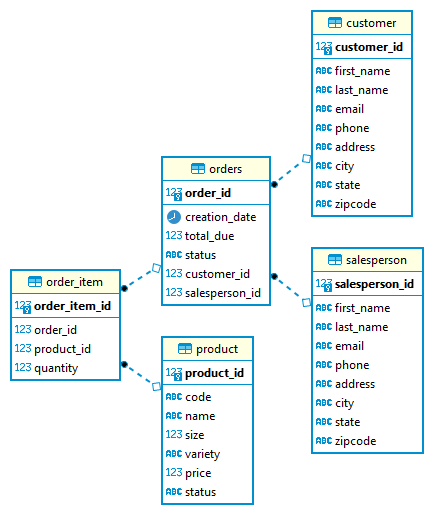

# Introduction
This program implements Java Database Connectivity (JDBC) to interface with a PostgreSQL database using the built-in SQL libraries in Java 8. A database access object class connects to a local database to perform basic create, read, update and delete (CRUD) operations on the database.

# Implementation
## ER Diagram
The database tables is structured as follows.

## Design Patterns
The program interfaces with the database through the use of a Data Access Object (DAO) that implements CRUD methods outlined in an abstract DataAccessObject class. These CRUD SQL statements are passed through a connection handled by a manager driver and executed on the database. Here the DAO pattern is applied for one table in the database, but as it follows an object-oriented design this allows for scalability and flexibility to handle more ways to work with the database.

An alternative approach would be to use the repository pattern which focuses on single-table access rather than accessing the database as a whole.

# Test
The database was created by pulling a PostgreSQL docker image and using it to create a database and tables from a set of provided .sql files. A connection manager initializes the connection to the database and a JDBCExecutor class file utilizes methods implemented in a DAO class file to demonstrate CRUD operations. The results of these operations can be verified using the `psql` command line tool to directly read from the database, or through a GUI-based program such as DBeaver.