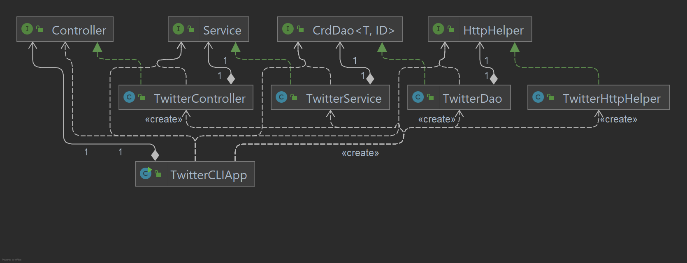

# Introduction
A Java based application for creating, reading and deleting tweets on [twitter.com](https://twitter.com/). Running through a Docker image the program works from the command line to process user-passed arguments and forward serialized JSON tweets to Twitter's official REST API (this project implements Standard v1.1). Tweets are created with status text and point coordinates in latitude:longitude form, shown with the tweet's unique ID value and deleted in batches. JSON processing libraries such as [Jackson JSON](https://github.com/FasterXML/jackson) are used to serialize and deserialize tweet objects, and dependencies are handled through Spring Boot.

# Quick Start
This project implements JUnit 4 and is packaged with Maven (`mvn clean package`). See [pom.xml](pom.xml) for JDK version and required dependencies.

To run the project, pull the Docker image from Docker Hub with `docker pull niharsheth/java_apps`. This application requires access to a Twitter developer application and its keys and tokens. These secrets need to be passed to the created container as environment variables. The arguments passed to the program are a request type and the corresponding fields. Three request types are supported:
* `post` - Create a new tweet, arguments passed are a text string for the tweet's status and a location string in the latitude:longitude format (point type location). This will return the created tweet to the terminal in JSON format.
* `show` - Read an existing tweet, argument passed is the unique numerical ID value for the reference tweet. This will return an abridged version of the tweet object in JSON format to the terminal.
* `delete` - Delete an existing tweet, or multiple tweets at once. The argument passed is a list of tweet IDs separated by a comma with no spaces. This returns the JSON form of each deleted tweet to the terminal.

# Design

## UML Diagram

* `TwitterCLIApp` - The frontend that parses user-passed arguments on the command line. This class implements the `CommandLineRunner` interface and its `run()` method to forward arguments to the controller layer and the returned tweet objects are printed to the terminal in a readable JSON format.
* `TwitterController` - This layer parses text arguments and converts them to the necessary data types in order to forward the request to the service layer. The controller verifies the number of arguments passed are correct as well.
* `TwitterService` - This is an intermediary layer that handles the business logic behind handling the user requests. When posting a tweet this layer checks that the text passed for the tweet is within Twitter's standard character limit and the location coordinates are of the correct type and separated with a colon. For showing and deleting tweets this layer checks to see if the passed tweet IDs are valid. Once these checks are passed the data is forwarded to the data access object (DAO) layer.
* `TwitterDao` - This layer constructs the URI for each request with the arguments passed as queries and then sent to the REST API with the use of an HTTP helper class. The response is returned as a tweet object and sent back up to the client.
* `TwitterHttpHelper` - This class implements two methods for sending POST and GET requests to Twitter's API. Application keys and tokens are used here to authenticate the connection using OAuth1.

## Models
Each command involves serializing and deserializing tweet objects to and from a JSON format. The Jackson JSON library is used along with a set of model classes to handle this process. The JSON format used here is not the full version used by Twitter, only a selected set of tweet properties are used here and as such the model classes are made only to support these selected properties.
* `Tweet` - This is the primary model class that encapsulates the other model classes. The selected properties are the time and date of creation, the tweet ID in `long` and `String` formats, the `Entities` and `Coordinates` objects (see below), a count of the total retweets and likes and retweeted and liked statuses.
  * `Entities` - This object encapsulates two other model classes, `Hashtag` and `UserMention` since the tweet object writes them to JSON as a set.
    * `Hashtag` - This has two properties, indices, an integer array that keeps track of the index position where the hashtag appears in the tweet body and the text content of the hashtag itself.
    * `UserMention` - This class holds the unique ID of the mentioned user(s) in `long` and `String` formats, the index position where the mention appears as well as the name and screen_name (the @username). Each mention is stored in a list in JSON.
  * `Coordinates` - Coordinates are the only location type utilized in this project, they are stored as a float-type array containing the latitude and longitude values as well as a String variable to indicate that the location is of "Point" type to the Twitter API.

Additionally, some properties used by the Twitter API were ignored as the program did not need to send/read values for these properties when communicating with the API.

A service layer implements the business logic when it comes to handling valid information passed by the user. For example the maximum character limit for a tweet is 280 characters and the latitude/longitude values must be within an acceptable range.

## Spring
Several layers are implemented in this project, starting from the frontend CLI application, to the HTTP response layer that communicates directly with Twitter's REST API. There is a linear sequence of dependencies and in order to handle these the Spring framework is used to manage them. An IoC container scans for components in the base package and beans are tagged with stereotypes of `Component`. In the front-end CLI class these dependencies are handled through the constructor. Spring Boot is also implemented here with the web servlet disabled to set up multiple annotations automatically.

# Test
Each layer of the program was integration tested during development. The linear chain of dependencies allowed for a bottom-up development and as each layer was implemented it was tested.

## Deployment
This project was deployed using Docker to create an image that can easily be pulled from Docker Hub and run on client machines. After packaging the program with Maven, an executable .JAR file is generated in the [target](/target) directory. The [Dockerfile](Dockerfile) indicates the JDK version and location of the latest .JAR executable for the project.

# Improvements
An improvement on the user side would make the JSON text output more readable. Although the JSON string is indented and properties are clearly labelled it can be presented in a more human-readable format, and unnecessary information such as hashtag and user mention indices can be ommitted. The properties can also be ordered in a way similar to how tweets are presented on Twitter, with the username and screen name up top, the body in the center and metric counts at the bottom.

On the backend the model classes could be expanded upon to present more information in the tweet objects and even support other location types such as passing the name of a place rather than a specific set of coordinates. This would again be more intuitive for the user.

Finally, the number of HTTP requests to the API can be increased to provide more functionality to the program overall. For example, performing actions such as liking and retweeting tweets can be implemented.