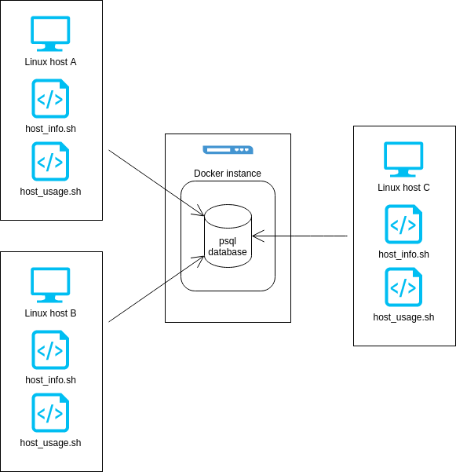

# Linux Cluster Monitoring Agent
This project is under development. Since this project follows the GitFlow, the final work will be merged to the master branch after Team Code Team.

# Introduction
The purpose of this project is to design a basic program for recording hardware specifications of nodes in a Linux cluster and monitoring their resource usages in real time and inserting into a database. This is implemented using a ` psql` instance and bash agents on each node that run two scripts for collecting hardware info and monitoring resource usage with the use of `crontab`.

# Quick Start
1. A `psql` instance is created using `psql_docker.sh`: `./scripts/psql_docker.sh create db_username db_password`
   1. Once created the instance can be stopped and started using `./scripts/psql_docker.sh start|stop`
   2. Default username and password are postgres and password
2. Create `host_agent` database and `host_info` and `host_usage` tables with `psql -h localhost -U postgres -d host_agent -f sql/ddl.sql`
3. Enter host info with `bash /scripts/host_info.sh "localhost" 5432 "host_agent" "postgres" "password"`
4. Enter host usage info manually with `bash /scripts/host_usage.sh "localhost" 5432 "host_agent" "postgres" "password"`
5. Automate host usage entries using `crontab`: `* * * * * bash /home/centos/dev/jarvis_data_eng_NiharSheth/linux_sql/scripts/host_usage.sh "localhost" 5432 "host_agent" "postgres" "password" > /tmp/host_usage.log`

## Architecture

## Scripts
* `psql_docker.sh `- This script can create, stop or start a docker instance running psql. This is the central database that all hosts send information to. When creating the instance a username and password is passed.

* `host_info.sh` - This script collects hardware information and inserts into the database. The following data is captured:
  * The host name 
  * Number of CPUs 
  * CPU architecture 
  * The CPU model 
  * CPU frequency in MHz 
  * L2 cache in kB 
  * Total system memory in kB 
  * Timestamp at the moment of data collection
  

* `host_usage.sh` - This script collects resource usage information every minute with the use of `crontab` and inserts into the database. The following data is captured:
  * Timestamp at the moment of data collection
  * Free memory in MB
  * Percentage of CPU time spent idle
  * Percentage of CPU that is spent running kernel code
  * Number of disk I/O operations
  * Available disk space at the root directory in MB

## Database Modeling
Two tables are used to keep track of data, `host_info` which contains static data on the host's specs and `host_usage` which is updated every minute with current resource usages for each connected host.

`host_info`

| id | hostname | cpu_number | cpu_architecture | cpu_model | cpu_mhz | l2_cache | total_mem | timestamp_info |
| --- | --- | --- | --- | --- | --- | --- | --- | --- |
Auto-incrementing integer ID number. | Unique varchar name of host. | Integer count of CPUs. | CPU architecture stored as a varchar. | CPU model as varchar. | CPU frequency as double precision. | L2 cache as varchar. | Total memory as varchar. | Timestamp at moment of data collection as timestamp. |

host_usage

| timestamp_usage | host_id | memory_free | cpu_idle | cpu_kernel | disk_io | disk_available |
| --- | --- | --- | --- | --- | --- | --- |
| Timestamp at moment of data collection as timestamp. | Foreign key ID based on `host_usage` ID | Free memory as varchar. | CPU idle percentage as integer. | CPU kernel percentage as integer. | Number of disk I/Os as integer. | Available disk space at root as varchar. |

# Test
DDL commands were tested to check that the appropriate variable type was selected for all the data. The DML queries were tested within the `psql` instance to check if data was being entered correctly, and then it was automated using `crontab`. Entries were allowed to accumulate for a while to ensure that they were coming in every minute. 

# Deployment
The application was deployed within a virtual machine running CentOS 7 using a `docker` instance to hold the `psql` database and `crontab` to automate regular host usage data collection.

# Improvements
At the moment the data collected within `host_info` is static, it is presumed that the hardware for each host will not change. In the future the DDL and DML scripts could be updated to handle any changes in hardware. `host_usage` could also be updated to collect more resource data such as network data for each host.