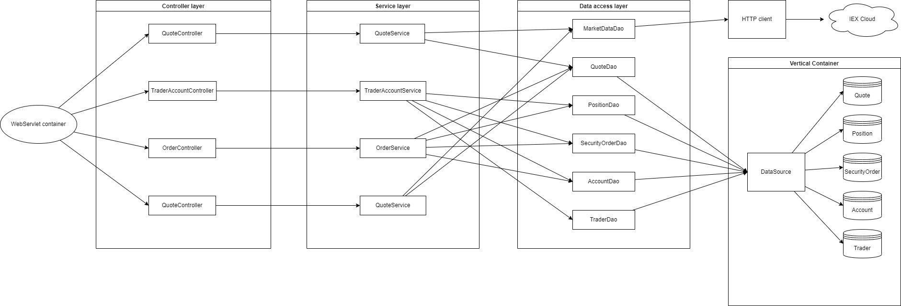

Table of Contents
* [Introduction](#Introduction)
* [Quick Start](#Quick Start)
* [Implementation](#Implementation)
* [Test](#Test)
* [Deployment](#Deployment)
* [Improvements](#Improvements)

# Introduction
This Java application is a trading platform that consumes the IEX Cloud REST API and allows users to manage client profiles/accounts, monitor their portfolio performance and trade securities. Data such as market data and latest quotes are pulled, updated and stored in a database from a webservlet interface.

This application is implemented in Java 8 with the Spring Boot framework to handle dependencies as it follows a microservice architecture. JDBC connectivity is handled by JDBC packages in Spring Boot such as the JdbcTemplate and SimpleJdbcInsert classes. Swagger is used as a front-end client to handle HTTP requests and the application is deployed as a Docker image. The project itself is managed and packaged using Maven.

# Quick Start
- Prequiresites: Docker, CentOS 7
- Docker scripts with description
    - build images
    - create a docker network
    - start containers
- Try trading-app with SwaggerUI (screenshot)

Docker is required to pull the application image and deploy on a local machine, along with the PSQL database image to persist user data. With the application running the API can be interfaced with from Swagger by launching it in a web browser.

# Implementation

## Architecture
- Draw a component diagram that contains controllers, services, DAOs, SQL, IEX Cloud, WebServlet/Tomcat, HTTP client, and SpringBoot. (you must create your own diagram)

- Controller layer: User requests to the API are handled here, each controller forwards the request to its corresponding service layer.
- Service layer: Business logic is verified, such as validating passed arguments.
- DAO layer: Directly communicates with the datasource to store and retrieve data in the database.
- PSQL: PostgreSQL is used to provide a database to persist user data in tables.
- IEX: Rest API for accessing current market data, used by the application to retrieve formatted JSON data online.
- Spring Boot: Handles application dependencies and launches program in an Apache TomCat webservlet container.

## REST API Usage

### Swagger
Swagger is an open source set of API developer tools used to build APIs. It presents APIs in a JSON format and can automate the process of documentation and code generation. Swagger is a convenient tool in this project as it provides an easy-to-use interface for using the controller layer classes to send requests along with documentation such as model examples, possible responses and organized endpoints.

### Quote Controller
- High-level description for this controller. Where is market data coming from (IEX) and how did you cache the quote data (PSQL). Briefly talk about data from within your app
- briefly explain each endpoint
  e.g.
    - GET `/quote/dailyList`: list all securities that are available to trading in this trading system blah..blah..

### Trader Controller
- High-level description for trader controller (e.g. it can manage trader and account information. it can deposit and withdraw fund from a given account)
- briefly explain each endpoint

### Order Controller
- High-level description for this controller.
- briefly explain each endpoint

### App Controller
- briefly explain each endpoint

### Optional (Dashboard Controller)
- High-level description for this controller.
- briefly explain each endpoint

# Test
How did you test your application? Did you use any testing libraries? What's the code coverage?

# Deployment
- docker diagram including images, containers, network, and docker hub
  e.g. https://www.notion.so/jarviscanada/Dockerize-Trading-App-fc8c8f4167ad46089099fd0d31e3855d#6f8912f9438e4e61b91fe57f8ef896e0
- describe each image in details (e.g. how psql initialize tables)

# Improvements
If you have more time, what would you improve?
- at least 3 improvements